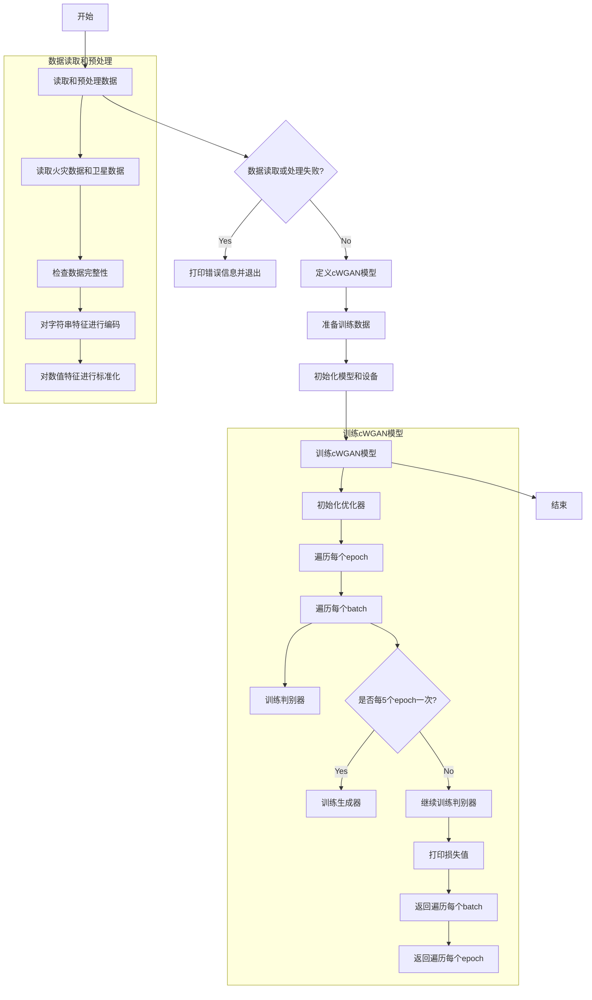
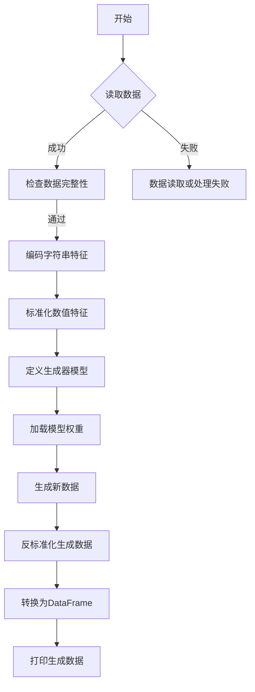
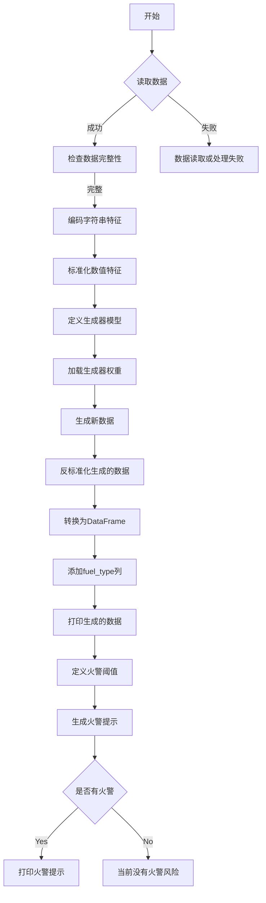
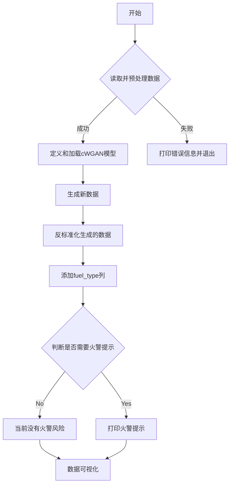

# California_Wildfire_Prediction
Wasserstein生成对抗网络-cWGAN-预测加州山火风险

主要围绕：Wasserstein生成对抗网络-cWGAN-预测加州山火风险-01.ipynb

## 步骤1：

### 代码功能解释

这段代码的主要功能是读取火灾数据和卫星数据，进行预处理（包括编码和标准化），并使用条件WGAN（cWGAN）模型生成模拟的火灾风险数据。具体步骤如下：

1. **读取和预处理数据**：从Excel文件中读取火灾数据和卫星数据，检查数据完整性，对字符串特征进行编码，并对数值特征进行标准化。
2. **定义cWGAN模型**：定义生成器和判别器（Critic）网络结构，并实现梯度惩罚计算函数。
3. **训练cWGAN模型**：准备训练数据，初始化模型和设备，训练cWGAN模型，输出每个epoch的损失值。

### 控制流图（CFG）

### 解释

- **开始**：程序启动。
- **读取和预处理数据**：读取火灾数据和卫星数据，检查数据完整性，对字符串特征进行编码，并对数值特征进行标准化。
- **数据读取或处理失败？**：判断数据读取或处理是否成功，如果失败则打印错误信息并退出。
- **定义cWGAN模型**：定义生成器和判别器（Critic）网络结构，并实现梯度惩罚计算函数。
- **准备训练数据**：将预处理后的数据转换为Tensor格式，并创建DataLoader。
- **初始化模型和设备**：初始化生成器、判别器和设备（CPU或GPU）。
- **训练cWGAN模型**：训练cWGAN模型，输出每个epoch的损失值。
- **结束**：程序结束。

通过控制流图可以清晰地看到整个程序的执行流程和逻辑分支。

## 步骤2：

### 代码功能解释

这段代码的主要功能是读取火灾数据，进行预处理（编码和标准化），然后使用条件生成对抗网络（cWGAN）生成新的火灾数据，并将生成的数据反标准化后输出。具体步骤如下：

1. **读取和检查数据**：从Excel文件中读取火灾数据并检查是否包含所有必要列。
2. **数据预处理**：对字符串特征进行编码，并对数值特征进行标准化。
3. **定义和初始化模型**：定义cWGAN的生成器模型，并加载预训练权重。
4. **生成新数据**：使用生成器生成新的火灾数据，并将生成的数据反标准化。
5. **输出生成数据**：将生成的数据转换为DataFrame格式并打印前几行。

### 控制流图（CFG）

### 详细说明

- **A[开始]**：程序开始执行。
- **B{读取数据}**：尝试从指定路径读取Excel文件中的火灾数据。
- **C[检查数据完整性]**：检查数据集中是否包含所有必要的列。
- **D[编码字符串特征]**：对`fuel_type`列进行编码。
- **E[标准化数值特征]**：对温度、湿度和风速进行标准化。
- **F[定义生成器模型]**：定义cWGAN的生成器模型结构。
- **G[加载模型权重]**：加载预训练的生成器模型权重。
- **H[生成新数据]**：使用生成器生成新的火灾数据。
- **I[反标准化生成数据]**：将生成的数据反标准化。
- **J[转换为DataFrame]**：将生成的数据转换为DataFrame格式。
- **K[打印生成数据]**：打印生成数据的前几行。
- **L[数据读取或处理失败]**：如果数据读取或处理失败，输出错误信息并退出程序。

## 步骤3：

### 代码功能解释

这段代码的主要功能是读取加州火灾数据，进行预处理后使用条件生成对抗网络（cWGAN）生成新的火灾数据，并根据设定的阈值判断是否发出火警提示。具体步骤如下：

1. **读取和预处理数据**：从Excel文件中读取火灾数据，检查必要列是否存在，对字符串特征进行编码，并对数值特征进行标准化。
2. **定义和加载cWGAN模型**：定义生成器模型并加载预训练权重。
3. **生成新数据**：使用生成器生成新的火灾数据，并反标准化。
4. **生成火警提示**：根据设定的温度和湿度阈值，判断是否需要发出火警提示。

### 控制流图（CFG）

### 解释

- **开始**：程序启动。
- **读取数据**：尝试从Excel文件中读取火灾数据。
- **检查数据完整性**：确保数据集中包含所有必要的列。
- **编码字符串特征**：将字符串类型的`fuel_type`列转换为数值型。
- **标准化数值特征**：对`temperature`、`humidity`、`wind_speed`列进行标准化。
- **定义生成器模型**：定义cWGAN的生成器模型结构。
- **加载生成器权重**：加载预训练的生成器模型权重。
- **生成新数据**：使用生成器生成新的火灾数据。
- **反标准化生成的数据**：将生成的数据反标准化为原始尺度。
- **转换为DataFrame**：将生成的数据转换为Pandas DataFrame格式。
- **添加fuel_type列**：将`fuel_type`列添加到生成的数据中。
- **打印生成的数据**：输出生成的数据前几行。
- **定义火警阈值**：设定温度和湿度的阈值。
- **生成火警提示**：根据阈值判断是否需要发出火警提示。
- **是否有火警**：判断是否有满足条件的火警记录。
- **打印火警提示**：如果有火警记录，则打印火警提示。
- **当前没有火警风险**：如果没有火警记录，则提示当前没有火警风险。
- **数据读取或处理失败**：如果数据读取或处理过程中出现错误，则输出错误信息并退出程序。

## 步骤4：

### 代码功能解释

这段代码的主要功能是使用条件生成对抗网络（cWGAN）生成模拟的加州火灾数据，并根据生成的数据进行火警提示和可视化。具体步骤如下：

1. **数据读取与预处理**：从Excel文件中读取火灾数据，检查必要列是否存在，对字符串特征进行编码，并对数值特征进行标准化。
2. **定义和加载cWGAN模型**：定义生成器模型并加载预训练的权重。
3. **生成新数据**：使用生成器生成新的火灾数据，并反标准化生成的数据。
4. **火警提示**：根据设定的温度和湿度阈值，判断是否需要发出火警提示。
5. **数据可视化**：绘制散点图、直方图等图表，展示生成数据的分布情况。

### 控制流图（CFG）

### 流程图说明

- **A[开始]**：程序开始执行。
- **B{读取并预处理数据}**：尝试读取Excel文件中的火灾数据，进行必要的预处理。如果成功则继续，否则打印错误信息并退出。
- **C[定义和加载cWGAN模型]**：定义生成器模型并加载预训练的权重。
- **D[生成新数据]**：使用生成器生成新的火灾数据。
- **E[反标准化生成的数据]**：将生成的数据反标准化为原始尺度。
- **F[添加fuel_type列]**：将生成的数据转换为DataFrame，并添加`fuel_type`列。
- **G{判断是否需要火警提示}**：根据设定的温度和湿度阈值，判断是否需要发出火警提示。
- **H[打印火警提示]**：如果有火警提示，则打印相关数据。
- **I[当前没有火警风险]**：如果没有火警提示，则打印当前没有火警风险。
- **J[数据可视化]**：绘制散点图、直方图等图表，展示生成数据的分布情况。
- **K[打印错误信息并退出]**：如果数据读取或处理失败，则打印错误信息并退出程序。
